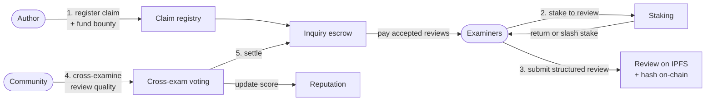
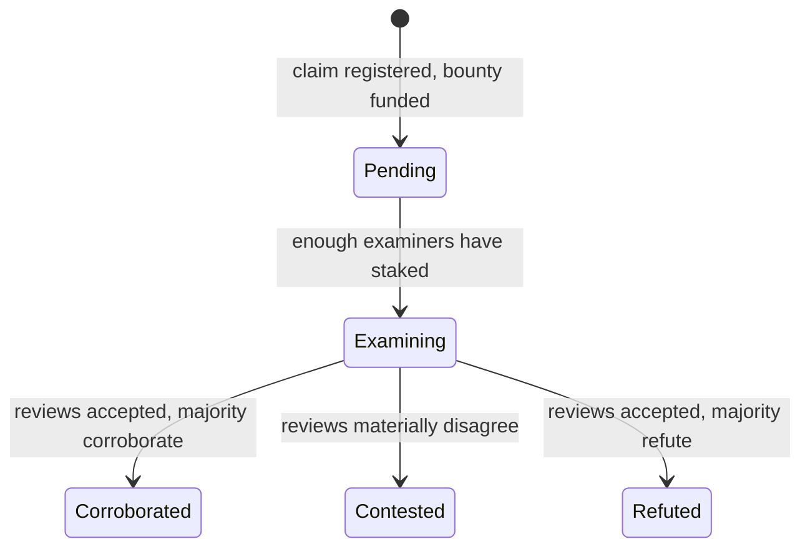

<p align="center">
  
</p>

<h3 align="center">Open peer review, rewarded.</h3>

<p align="center">
  An open-source protocol on <a href="https://stellar.org">Stellar</a> where reviewers are paid for rigor,<br>
  held accountable for quality, and credited for their work.
</p>

<p align="center">
  <a href="https://github.com/elenchus-hq/elenchus-protocol"><b>Repository</b></a> &nbsp;·&nbsp;
  <a href="https://github.com/elenchus-hq/elenchus-protocol/blob/main/docs/protocol-spec.md">Protocol spec</a> &nbsp;·&nbsp;
  <a href="https://github.com/elenchus-hq/elenchus-protocol/blob/main/docs/threat-model.md">Threat model</a> &nbsp;·&nbsp;
  <a href="https://github.com/elenchus-hq/elenchus-protocol/blob/main/CONTRIBUTING.md">Contribute</a> &nbsp;·&nbsp;
  <a href="https://github.com/elenchus-hq/elenchus-protocol/labels/good%20first%20issue">Good first issues</a>
</p>

<p align="center">
  
  
  
  
  
</p>

---

## The name

In Greek philosophy, the **elenchus** is the method of testing a claim by questioning it. It is how Socrates examined ideas: ask, probe, cross-examine, and keep what survives.

Peer review is meant to do the same for science. In practice it is unpaid, opaque, and invisible on a researcher's record. Elenchus Protocol rebuilds it as an open, accountable process.

## The problem

| What happens today | Why it hurts |
|---|---|
| Reviewers work for free | Review is slow, rushed, or declined. The people doing a vital job get nothing for it. |
| Reviews are hidden | Nobody can check whether a review was careful, biased, or copied. |
| Reviewing leaves no record | A researcher's hundreds of hours of review do not appear in any career metric. |
| Replications and null results are unrewarded | Journals prefer novelty, so the literature skews toward flashy results. |
| Low-effort reviews carry no cost | There is no consequence for a careless or dishonest review. |

## The idea

Make review a **transparent, funded, accountable market for scrutiny**:

- **Authors** register a claim (a manuscript) and fund a review bounty.
- **Examiners** stake to review it and are paid when their review holds up.
- **The community cross-examines the reviews themselves**, so quality is judged in the open.
- **Reputation is earned and portable.** It belongs to the examiner, not to any journal.

A verdict says what examiners concluded after open scrutiny. It is not a stamp of truth, and the protocol is built to make that distinction clear.

## How it works



1. **Register.** An author anchors a manuscript on-chain by its SHA-256 hash and IPFS CID, then funds a bounty in a Stellar stablecoin.
2. **Stake.** Examiners lock stake to claim an assignment. Stake makes a no-show or a copied review costly.
3. **Review.** Examiners submit a structured review against an open rubric (novelty, methodology, reproducibility, clarity), with evidence for every score.
4. **Cross-examine.** Authors, peer examiners, and editors vote on review quality, weighted by reputation.
5. **Settle.** Accepted reviews are paid from escrow and stake returns. Rejected reviews forfeit part of their stake. Reputation updates either way.

### Claim lifecycle



| State | Meaning |
|---|---|
| **Pending** | Registered and funded, waiting for examiners |
| **Examining** | Required examiners have staked and reviews are in progress |
| **Corroborated** | Reviews accepted, and the majority recommend corroboration |
| **Contested** | Reviews disagree materially. This is a legitimate, visible outcome |
| **Refuted** | Reviews accepted, and the majority recommend refutation |

## Design principles

- **Trust what must be trustless, keep the rest off-chain.** Escrow, stake, reputation, and vote tallies live on-chain. Manuscripts and review text live on IPFS, anchored by hash.
- **Reward rigor, not volume.** Reviews that attempt reproduction weigh more in quality voting. Null and replication results are first-class.
- **Small, separate contracts.** One responsibility per contract, so each can be audited on its own.
- **Reputation is non-transferable.** It cannot be bought, sold, or moved.
- **The indexer is replaceable.** Anyone can rebuild it from contract events. It is never a source of truth.
- **Open by default.** Specs, rubric, threat model, and decisions (as ADRs) are public and editable by pull request.
- **Honest about limits.** Verdicts are scoped claims about review, not claims about truth.

## Why Stellar

- **Very low fees**, so paying for individual reviews and micro-bounties is economically viable.
- **Native asset issuance and stablecoin rails**, so bounties can be paid in familiar currency.
- **Soroban smart contracts** for escrow, staking, and voting logic.
- **Fast settlement**, so contributors see payment promptly.

## What is in the repo today

> **Status: early scaffold.** Testnet only. Unaudited. Do not use with real funds.

| Component | Status |
|---|---|
| `claim-registry` contract | Implemented, with unit tests |
| `inquiry-escrow`, `staking`, `reputation`, `cross-exam` contracts | Stubs with issues describing the intended interface |
| Design tokens (dark and light themes, contrast-checked) | Implemented |
| JSON Schemas for claims and reviews | Drafted |
| TypeScript SDK | Skeleton. Generated bindings are next |
| Web app (Vite + React) | Skeleton with sample data |
| Indexer / API | Skeleton |
| Protocol spec, threat model, review rubric, governance | Draft. Open questions are listed |
| CI, issue templates, starter issues | In place |

### Repository layout

```
elenchus-protocol/
├── contracts/        Soroban smart contracts (Rust workspace)
├── packages/
│   ├── tokens/       Design tokens → CSS variables, TypeScript, Tailwind preset
│   ├── schemas/      JSON Schemas for claims and reviews
│   └── sdk/          TypeScript client for the contracts
├── apps/
│   ├── web/          Frontend (Vite + React)
│   └── indexer/      Event indexer and API
├── docs/             Protocol spec, threat model, governance, ADRs
└── scripts/          Local dev, label sync, starter issues
```

### Tech stack

Rust and Soroban for contracts. TypeScript, React, and Vite for the app. pnpm workspaces and a Cargo workspace in one monorepo. IPFS for manuscripts. GitHub Actions for CI with path-filtered jobs.

## Roadmap

This is a proposed direction, not a promise. Priorities are set in the open by contributors and maintainers.

| Phase | Focus |
|---|---|
| **1. Foundations** | Escrow, staking, and reputation contracts with tests. Generated SDK bindings. Indexer ingesting claim events |
| **2. First end-to-end flow on testnet** | Wallet connect, claim submission with in-browser hashing and IPFS upload, examiner assignment, review submission |
| **3. Quality and abuse resistance** | Cross-examination voting, slashing parameters, Sybil and collusion mitigations from the threat model |
| **4. Pilots** | Work with a small community or preprint group on real, low-stakes review |
| **5. Review and audit** | External security review before any mainnet discussion |

## Open questions we want help with

These are the hard design problems. Research and writing contributions are as valuable as code.

1. **Who decides review quality?** Authors are conflicted and pure voting can be gamed.
2. **How should reputation be scoped?** Per field is more meaningful but fragments the system.
3. **Anonymity:** blind, open, or the examiner's choice?
4. **Who funds bounties?** Authors, funders, institutions, or a community pool?
5. **Slashing:** what percentages, what appeal path, what time limits?
6. **Identity and Sybil resistance:** ORCID links, stake size, or both?

Start a thread in [Discussions](https://github.com/elenchus-hq/elenchus-protocol/discussions) or open a research issue.

## Get involved

| You are a... | Start here |
|---|---|
| **Rust / Soroban developer** | `contracts/` and issues labeled `area:contracts` |
| **Frontend developer** | `apps/web/` and issues labeled `area:web` |
| **Backend developer** | `apps/indexer/` and issues labeled `area:indexer` |
| **Security researcher** | `docs/threat-model.md`. Extend it with concrete attack scenarios |
| **Scientist or reviewer** | `docs/review-rubric.md`. Tell us what a good review needs that we missed |
| **Writer or designer** | `docs/` and `packages/tokens`. Worked examples and design review are welcome |

**Quick start**

```bash
git clone https://github.com/elenchus-hq/elenchus-protocol.git
cd elenchus-protocol
pnpm install
pnpm --filter @elenchus-protocol/tokens build
pnpm dev:web                 # frontend on localhost:5173
cd contracts && cargo test   # contract tests
```

Read [`CONTRIBUTING.md`](https://github.com/elenchus-hq/elenchus-protocol/blob/main/CONTRIBUTING.md) for workflow and standards, then pick a [`good first issue`](https://github.com/elenchus-hq/elenchus-protocol/labels/good%20first%20issue).

## FAQ

**Is this a journal?**
No. It is a protocol for funding and accountability in review. Journals, preprint servers, and communities could build on it.

**Does a "corroborated" verdict mean the science is true?**
No. It means examiners reviewed the claim under an open rubric and the community accepted their reviews. Science stays provisional.

**Why a blockchain at all?**
For the parts that need neutral, auditable rules: holding bounties in escrow, enforcing stake and slashing, and keeping a reputation record that no single organization controls. Everything large or private stays off-chain.

**Can reviewers stay anonymous?**
Undecided. It is one of the open questions above.

**Is real money involved?**
Not yet. The protocol is testnet-only and unaudited.

**Who owns the reputation score?**
The examiner. It is non-transferable and tied to their address, not to a platform.

## Governance and conduct

Protocol-level decisions start in Discussions, are proposed as ADRs in `docs/adr/`, and are decided by maintainer consensus after a public comment window. See [`docs/governance.md`](https://github.com/elenchus-hq/elenchus-protocol/blob/main/docs/governance.md). Everyone participates under the [Code of Conduct](https://github.com/elenchus-hq/elenchus-protocol/blob/main/CODE_OF_CONDUCT.md).

## Security

Please report vulnerabilities privately through the repository's **Security** tab, not in a public issue. See [`SECURITY.md`](https://github.com/elenchus-hq/elenchus-protocol/blob/main/SECURITY.md). There is no bug bounty yet.

## License

Open source under the [MIT License](https://github.com/elenchus-hq/elenchus-protocol/blob/main/LICENSE).

---

<p align="center">
  <sub><i>Claims, cross-examined.</i></sub>
</p>

<!--
Banner fallback: if the animated SVG does not load in your environment, replace the first  with

-->
